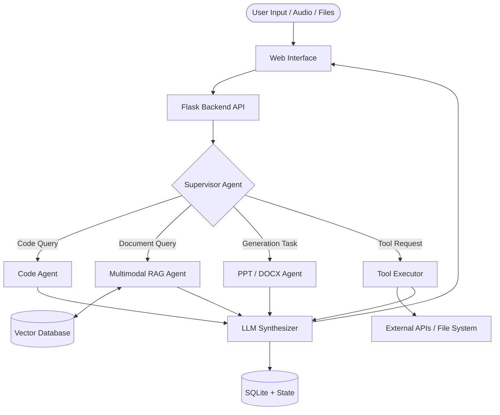

# 🚀 NextGen ChatGPT: Omni-Intelligence Platform

An advanced, **multimodal, multi-agent conversational AI system** designed to go beyond traditional chatbots. Built with a robust backend using **Flask + LangGraph**, NextGen ChatGPT dynamically routes user queries to specialized AI agents and enables powerful capabilities like **RAG-based document understanding, tool execution, voice interaction, and autonomous content generation**.

Each chat session acts as an independent AI workspace, maintaining its own memory, uploaded documents, and knowledge base, enabling seamless and powerful interactions.
---

## ✨ Key Features

* 🧠 **Multi-Agent Architecture**

  * Supervisor agent intelligently routes queries
  * Specialized agents: Chat, RAG, Code, Research, PPT, DOCX

* 📄 **Multimodal RAG (Retrieval-Augmented Generation)**

  * Supports PDF, DOCX, PPTX, TXT, Images, and Videos
  * Context-aware question answering

* 💾 **Persistent Memory & Multi-Session Chat**

  * SQLite-based conversation storage
  * Independent chat threads with context retention

* 🎙️ **Voice Intelligence**

  * Speech-to-Text using Groq Whisper
  * Text-to-Speech using gTTS with language detection

* 🛠️ **Dynamic Tool Execution**

  * Email (with Human-in-the-Loop)
  * Image generation & analysis
  * Calculator, stock API, WhatsApp messaging

* 🎨 **Modern Interactive UI**

  * Dark/Light mode
  * Real-time streaming responses
  * File previews & image lightbox

---

## 🧠 System Architecture



---

## 📁 Project Structure

```text
nextgen-chatgpt/
│
├── app.py                  # Flask entry point
├── config.py               # Configurations
├── requirements.txt
│
├── agents/                 # AI agents (chat, rag, code, ppt, docx)
├── api/                    # API routes (chat, upload, threads)
├── core/                   # Supervisor, workflow, memory, state
├── tools/                  # Tool integrations
├── workflows/              # LangGraph workflows
├── utils/                  # Helpers & processors
│
├── templates/              # Frontend HTML
├── static/                 # CSS & JS
│
├── uploads/                # User uploads
├── exports/                # Generated files
├── images/                 # AI-generated images
├── audio/                  # TTS output
├── data/                   # Vector DB
├── database/               # SQLite DB
```

---

## 🛠️ Tech Stack

**Backend & AI**

* Flask, Python
* LangGraph, LangChain
* Groq (LLaMA, Whisper)
* Google Gemini (optional)

**Data & Storage**

* FAISS / Chroma (Vector DB)
* SQLite (Memory)

**Frontend**

* HTML, CSS, JavaScript
* Streaming (SSE / Fetch API)

---

## ⚙️ Installation

```bash
git clone https://github.com/manavdhaye/NextGen-ChatGPT.git
cd NextGen-ChatGPT

python -m venv myenv
myenv\Scripts\activate   # Windows

pip install -r requirements.txt
```

---

## 🔐 Environment Variables

Create a `.env` file:

```env
GROQ_API_KEY=your_key
GOOGLE_API_KEY=your_key
IMAGE_CREATION_HF_TOKEN=your_key
ALPHA_VANTAGE_API_KEY=your_key
GMAIL_SENDER_EMAIL=your_email
GMAIL_APP_PASSWORD=your_password
```

⚠️ Never commit `.env` to GitHub.

---

## ▶️ Usage

```bash
python app.py
```

Open:

```text
http://127.0.0.1:5000
```

---

## 💡 Example Use Cases

* 📄 Ask questions from uploaded documents
* 🖼️ Analyze diagrams/images
* 🎨 Generate AI images
* 📊 Create PPT presentations
* 📝 Generate DOCX reports
* 📧 Draft & send emails (HITL)
* 🎙️ Voice-based interaction

---

## 📸 Screenshots

*(Add your screenshots here)*

* Chat Interface
* File Upload + RAG
* PPT Generation
* Multi-Agent Flow

---

## 🔮 Future Improvements

* OAuth login (Google/GitHub)
* Visual workflow builder (drag-drop LangGraph UI)
* Advanced video semantic search

---

## 🤝 Contribution Guidelines

1. Fork the repository
2. Create a branch

   ```bash
   git checkout -b feature-name
   ```
3. Commit changes
4. Push & create PR

---

## 📌 Summary

NextGen ChatGPT is a **next-generation AI platform** that combines:

* Multi-agent intelligence
* Multimodal RAG
* Persistent memory
* Real-world tool execution

👉 Built for scalable, real-world AI applications

---

⭐ If you like this project, consider giving it a star!

---

📎 Reference content used from your project: 
